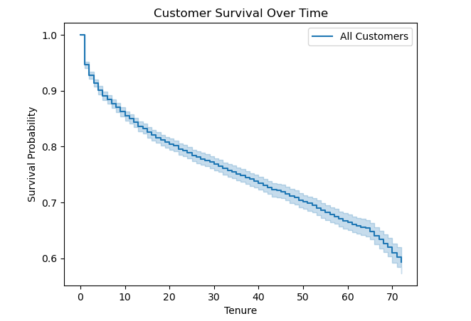
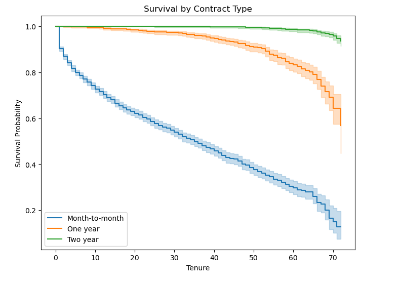
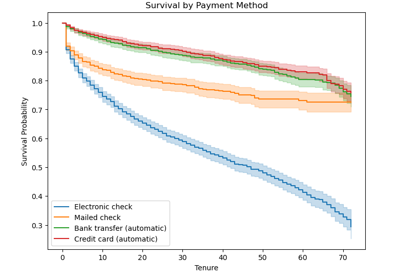
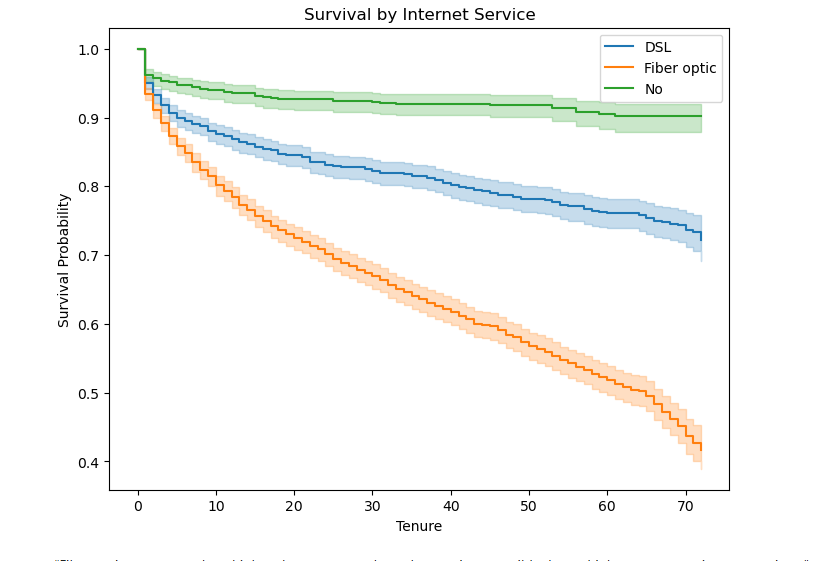
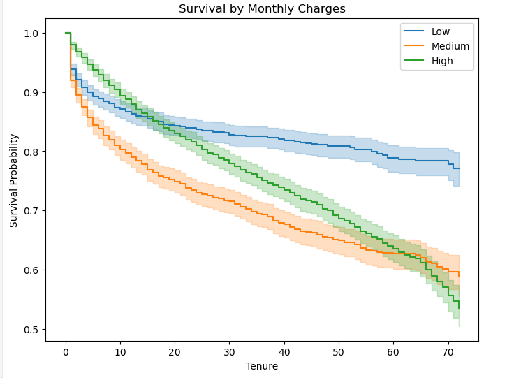
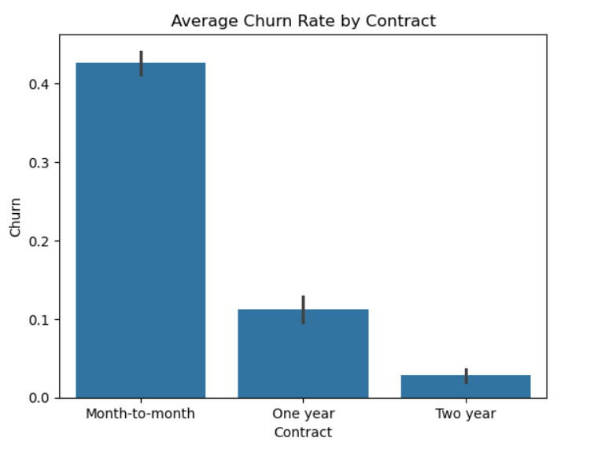
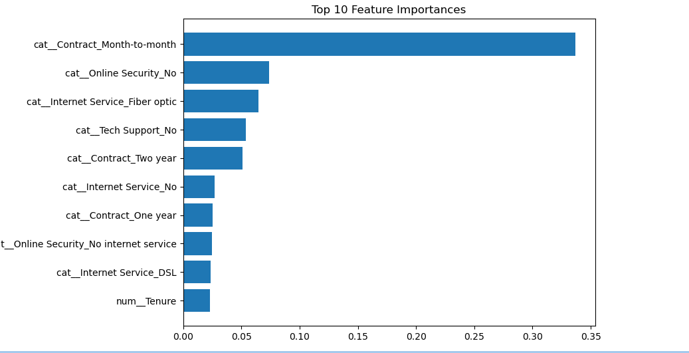

# 📉 Customer Churn Prediction & Survival Analysis API

An end-to-end Machine Learning project that predicts whether a telecom customer is likely to churn and provides business insights using **EDA, Feature Importance, Confusion Matrix, and Survival Analysis**.  
The trained model is deployed as a **FastAPI REST API** and containerized using **Docker**.

---

## 🚀 Project Overview

Customer churn directly impacts revenue in the telecom industry.  
This project helps identify customers who are likely to churn so companies can proactively retain them using targeted strategies.

The project includes:
- Exploratory Data Analysis (EDA)
- Feature Importance analysis
- Classification modeling
- Survival analysis using Kaplan–Meier
- REST API deployment
- Dockerized production-ready setup

---

## 🧠 Model Performance

```
            precision    recall  f1-score   support

           0       0.92      0.74      0.82      1035
           1       0.53      0.81      0.64       374

    accuracy                           0.76      1409
   macro avg       0.72      0.78      0.73      1409
weighted avg       0.81      0.76      0.77      1409
```


📌 **Why Recall Matters More Than Precision**  
In churn prediction, missing a churner is more costly than incorrectly flagging a loyal customer.  
This model prioritizes high recall to capture maximum churn-prone users.
- **Accuracy:** ~76%
- **Recall (Churn = 1):** ~81%
- **Precision (Churn = 1):** ~53%

---

## ⏳ Survival Analysis (Kaplan–Meier)

Survival analysis helps understand **how long customers stay** before churning.

### 🔹 Customer Survival Over Time


**Insight:**  

This shows how customer survival decreases over time.
Most churn happens in the early months, which highlights the importance of early engagement.
---


### 🔹 Average Churn Rate by Contract
Customers with **month-to-month contracts** have a significantly higher churn rate compared to long-term contracts.



**Insight:**  
“Month-to-month customers churn much earlier than customers on one-year or two-year contracts.
This suggests long-term contracts help improve retention

---

### 🔹 Survival by Payment Method


**Insight:**  
Electronic check users churn faster compared to other payment methods.
Customers using electronic check tend to churn faster than those using automatic payment methods.
This may be due to payment friction or missed payments.”

---

### 🔹 Survival by Internet Service


**Insight:**  
Fiber optic users show higher churn risk compared to DSL users.
“Fiber optic customers show higher churn compared to other services, possibly due to higher cost or service expectations.”

---
### 🔹 Survival by Monthly Charges (Binned)


**Insight:**  
Fiber optic users show higher churn risk compared to DSL users.
“Fiber optic customers show higher churn compared to other services, possibly due to higher cost or service expectations.”
```
```
## 📊 Exploratory Data Analysis (EDA)

### 🔹 Confusion Matrix
Shows how well the model distinguishes between churned and non-churned customers.


**Insight:**
- High true positives → good churn detection
- Some false positives → acceptable tradeoff for retention strategy

---

### 🔹 Avarage Chrun by contract 




## ⭐ Feature Importance

### 🔹 Top 10 Feature Importances
Identifies the most influential features driving churn predictions.



**Key Influential Features:**
- Contract type
- Tenure
- Monthly charges
- Payment method
- Internet service type

📌 This improves **model interpretability** and business trust.

---

## 🏗️ Tech Stack

- **Python**
- **Pandas, NumPy**
- **Scikit-learn**
- **Matplotlib, Seaborn**
- **Lifelines (Kaplan–Meier Survival Analysis)**
- **FastAPI**
- **Docker**
- **Joblib**

---

## 📁 Project Structure
```
.
├── app.py
├── requirements.txt
├── Dockerfile
├── .dockerignore
├── customer-churn-prediction.ipynb
│
├── model/
│ ├── costomer_churn_pipeline.pkl
│ └── predict.py
│
├── schema/
│ ├── user_input_pydantic.py
│ └── prediction_response.py
│
└── images/
├── avg_churn_by_contract.png
├── confusion_matrix.png
├── top_features.png
├── customer_survival.png
├── survival_by_contract.png
├── survival_by_payment.png
└── survival_by_internet.png
```

## 🔌 API Endpoints
```
### 🏠 `GET /`
Returns API welcome message and available endpoints.
```

### 🩺 `GET /health`
Health check for model and API.
```
json
{
  "status": "ok",
  "version": "1.0.0",
  "model_loaded": true
}
```
### Sample Output
```
{
  "predicted": 1,
  "churn_label": "Churn",
  "churn_probability": 0.78
}
```

## 🐳 Docker Hub

You can directly pull and run the API image from Docker Hub:

🔗 Docker Hub Repository:
https://hub.docker.com/r/dataforai/churn-prediction-api


## 🐳 Run with Docker

### Pull Image
docker pull dataforai/churn-prediction-api:latest

### Run Container
docker run -p 8000:8000 dataforai/churn-prediction-api:latest

### Swagger UI:

http://localhost:8000/docs

### 📌 Business Value

- Identifies high-risk churn customers
- Enables targeted retention strategies
- Reduces revenue loss
- Improves customer lifetime value (CLV)

[](https://hub.docker.com/r/dataforai/churn-prediction-api)


### 👩‍💻 Author

Divya
Aspiring Data Scientist / Machine Learning Engineer
